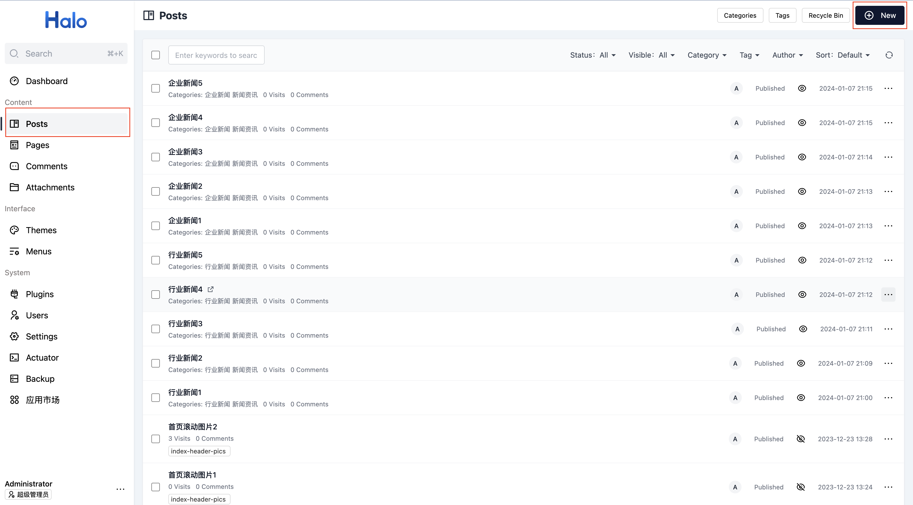
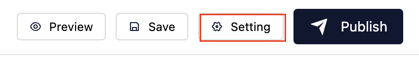
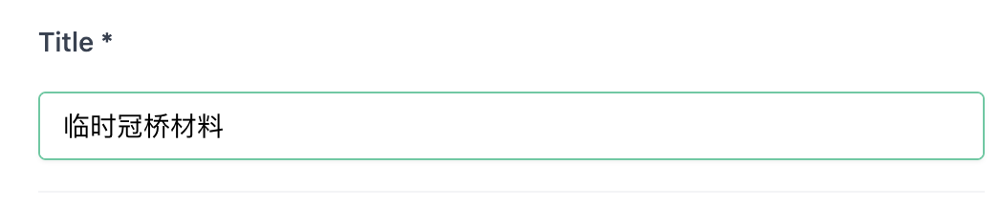
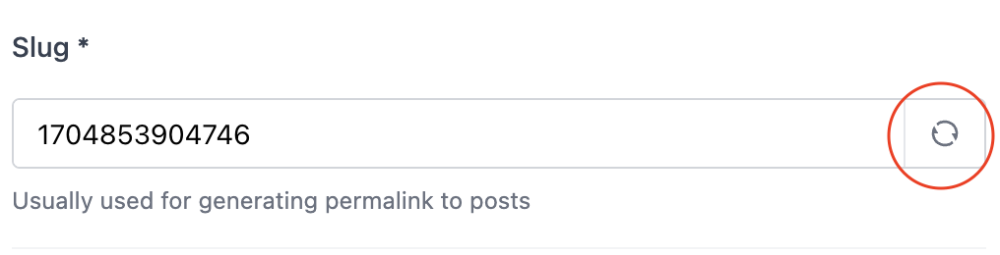
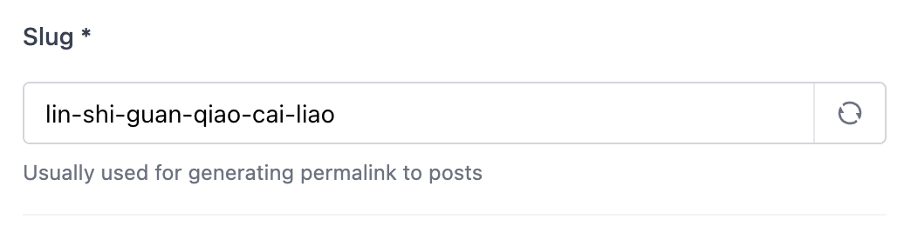
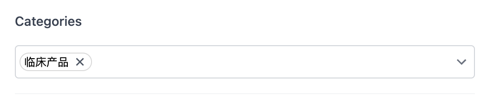
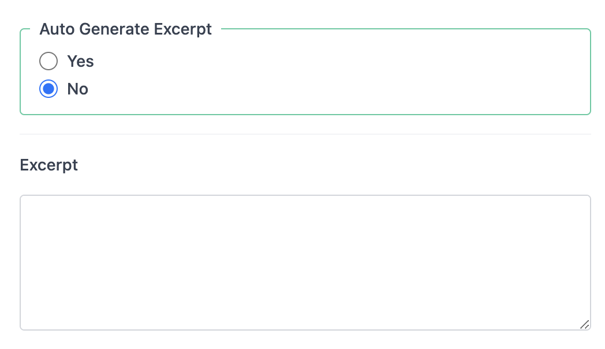

# 添加文章
根据本篇文章内容添加产品文章或新闻文章。

# 登录后台页面
在浏览器中输入url进入Halo控制台：`http://175.27.232.187/console`
输入用户名： `dingchen`
输入密码： `Dingchen4500Root`

# 新建文章
如图所示， 点击左侧导航栏的`文章(Posts)`, 再点击右上角的`+`创建一篇新文章：

在弹出的页面中，可以开始编辑文章内容，暂时先不急着填入文章内容， 先点击右上角的`Save(保存)`, 如图所示：

然后右上角会出现一个新的按钮`Setting(设置)`, 如下图, 点击它，开始设置文章的标题，摘要，封面等信息。

## 设置文章标题
在弹出的对话框中，设置文章标题，如该产品的名称是`临时冠桥材料`：

## 更新文章别名
文章别名用于生成文章的url链接， 点击别名对话框右侧的刷新按钮：

点击后， 会根据文章标题的拼音生成易读的别名：

## 选择文章分类
如果是产品文章，点击`Categories(分类)`下拉菜单, 选择正确的产品分类，例如`临床产品`, `技工产品`。

如果是新闻文章，点击`Categories(分类)`下拉菜单, 选择正确的文章分类，例如`行业新闻`, `企业新闻`。 另外还要选择一个分类`新闻资讯`。

## 编辑文章摘要
取消自动生成摘要，并且填入文章的摘要内容。

## 上传文章(产品)封面
在高级设置中，选择上传本地图片作为文章封面，将在首页的产品卡片和产品中心的产品卡片中展示。

完成后点击对话框左下角的`Save(保存)`，保存上述设置。

## 编辑文章内容
继续在文章中填入产品介绍等内容。

## 发布文章
编辑完成后，点击右上角的`Publish(发布)`，完成产品文章的发布.